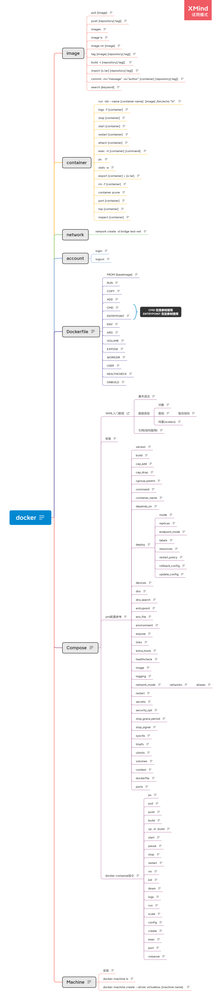

# docker

## 资料参考

[docker-菜鸟教程](https://www.runoob.com/docker/docker-repository.html)

## 备注

1. docker run --network test-net..，通过将多个容器连接到相同的网络，可以实现容器之间的网络连通
2. 配置dns
   1. 宿主机配置，设置全部容器的 dns，配置完需要重启 docker 才能生效

      `sudo nano /etc/docker/daemon.json`

      ```json
      {
        "dns" : [
          "114.114.114.114",
          "8.8.8.8"
        ]
      }
      ```

      重启 docker 服务

      `sudo systemctl restart docker`

      查看容器内的 dns 是否生效可以使用以下命令，它会输出容器的 dns 信息：

      `sudo docker run -it --rm ubuntu cat etc/resolv.conf`
    
    2. 手动指定容器的配置

        `sudo docker run -it --rm -h host_ubuntu --dns=114.114.114.114 -- dns-search=test.com ubuntu`
  

## 思维导图

[文件](docker.xmind)

